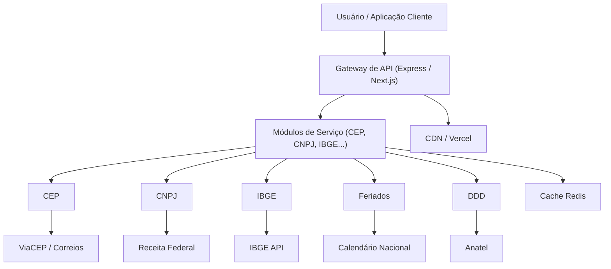
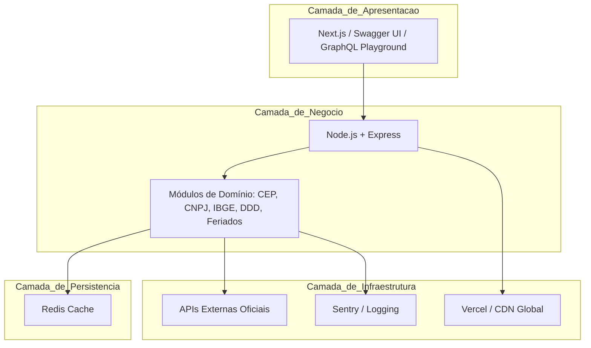
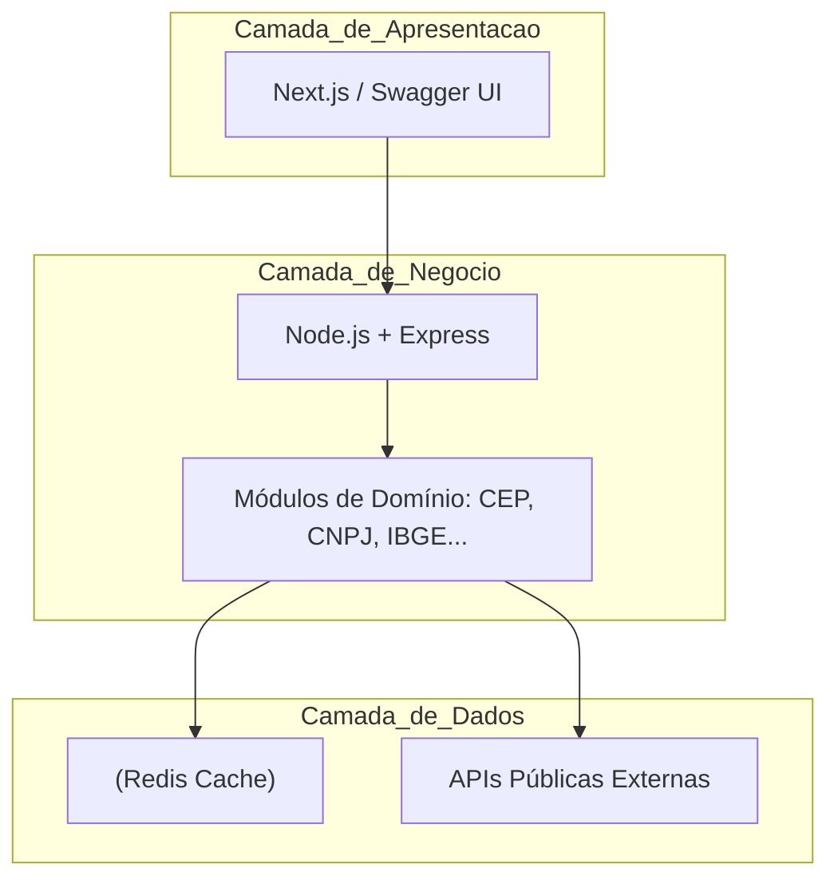
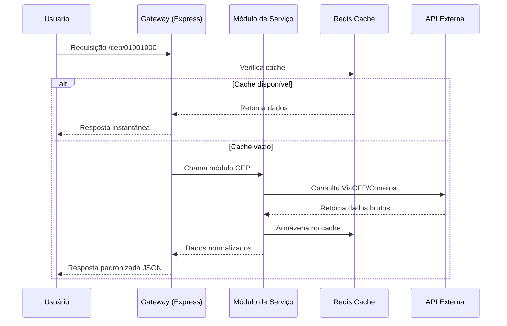
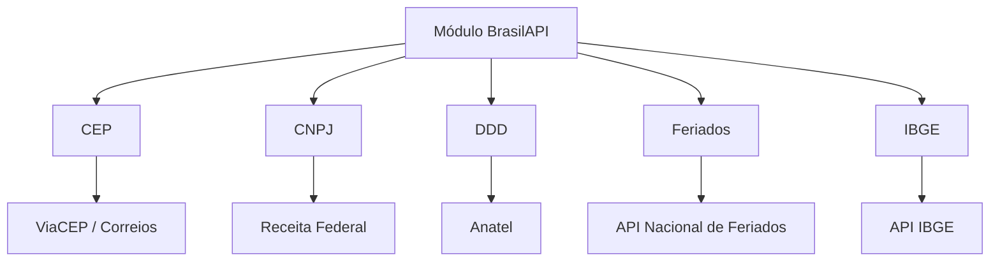
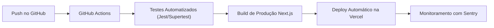
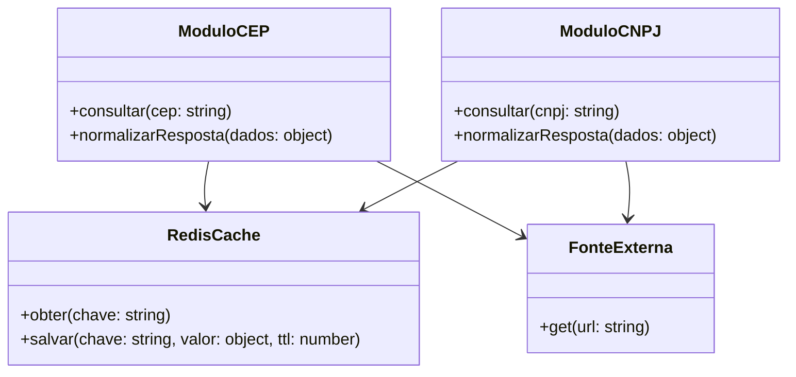

# 🇧🇷 **BrasilAPI – Unificando Dados Públicos do Brasil**
**Documentação Técnica Completa**

**Autor:** Comunidade Open Source  
**Fundador:** Filipe Deschamps  
**Projeto:** BrasilAPI  

---

## 1. Contexto do Sistema

### 1.1 Descrição Geral
A **BrasilAPI** é uma iniciativa **open source** cujo propósito é **centralizar e padronizar o acesso a dados públicos brasileiros**, que se encontram espalhados em múltiplas fontes governamentais, com formatos distintos e documentação precária.

O projeto fornece uma **API única, confiável e moderna**, permitindo que desenvolvedores consumam informações públicas sem depender da disponibilidade ou inconsistência das fontes originais.

---

## 2. Objetivos do Sistema

| Objetivo | Descrição |
|-----------|------------|
| Unificação | Agregar dados públicos de diversas origens em um único endpoint. |
| Padronização | Garantir consistência no formato de resposta e documentação. |
| Disponibilidade | Oferecer alta performance e redundância global. |
| Colaboração | Ser um projeto aberto à contribuição da comunidade. |
| Segurança | Aplicar boas práticas contra abusos e falhas. |

---

## 3. Arquitetura do Sistema

### 3.1 Visão Geral

A **BrasilAPI** adota uma **arquitetura modular e distribuída**, baseada em camadas e serviços independentes que garantem **alta disponibilidade, escalabilidade e manutenção simplificada**. Cada módulo representa um **domínio de dados públicos** (CEP, CNPJ, IBGE, DDD, Feriados), com **responsabilidade única** e integração direta com **APIs externas oficiais**.

A arquitetura contempla:

* **Camada de Apresentação:** Interface para usuários e aplicações, oferecendo documentação interativa, endpoints REST e GraphQL.
* **Camada de Negócio:** Implementa regras de domínio, transformação e normalização de dados, além da lógica de fallback entre provedores.
* **Camada de Persistência e Cache:** Garante performance, reduz latência e protege contra falhas de provedores externos.
* **Camada de Infraestrutura:** Hospedagem global, monitoramento e CI/CD automatizado para entrega contínua.

**Descrição detalhada do fluxo:**

1. **Solicitação do usuário:**
   O cliente envia uma requisição HTTP/GraphQL para o **Gateway de API** (Next.js/Express).

2. **Verificação de cache:**
   Antes de chamar o módulo de serviço, a requisição é verificada no **Redis Cache** para evitar chamadas desnecessárias às APIs externas.

3. **Módulo de Serviço:**

   * Recebe a requisição caso o cache não possua dados.
   * Consulta as **APIs externas oficiais** do domínio solicitado.
   * Normaliza os dados em formato **JSON padronizado**.
   * Executa fallback automático caso algum provedor esteja indisponível.

4. **Armazenamento em cache:**
   Os dados obtidos são armazenados no **Redis** com TTL configurável, garantindo respostas rápidas para futuras requisições.

5. **Resposta ao cliente:**
   A API retorna os dados padronizados, garantindo **consistência, performance e disponibilidade**.

---

### 3.2 Camadas Arquiteturais

**Detalhes adicionais:**

* **Modularidade:** Cada domínio é um módulo independente, facilitando deploy isolado, testes e contribuições da comunidade.
* **Fallback e resiliência:** Caso um provedor externo falhe, a lógica interna alterna para um provedor secundário ou retorna dados parcialmente disponíveis.
* **Escalabilidade horizontal:** Módulos podem ser escalados individualmente, e a camada de cache distribui a carga, garantindo desempenho mesmo em picos.
* **Segurança:** Rate limiting, validação de entradas e proteção contra ataques comuns via middleware (Helmet, CORS, etc.).
* **Observabilidade:** Logs estruturados e monitoramento contínuo com Sentry permitem identificar falhas e monitorar métricas críticas em tempo real.

---

## 4. Componentes Arquiteturais

### 4.1 Diagrama de Camadas

---

### 4.2 Fluxo de Requisição e Cache

---

## 5. Decisões Arquiteturais (ADRs)

### ADR-001 – Framework e Hospedagem
**Decisão:** Uso de **Next.js + Vercel**  
**Motivo:** Permite documentação interativa e deploy contínuo sem configuração complexa.  
**Consequência:** A documentação e a API compartilham o mesmo domínio e pipeline de CI/CD.

---

### ADR-002 – Cache Redis Distribuído
**Decisão:** Adotar **Redis Cloud** com TTL configurável.  
**Motivo:** Reduz chamadas a APIs externas lentas.  
**Consequência:** Desempenho previsível e redução de falhas por timeout.

---

### ADR-003 – Modularização de Serviços
**Decisão:** Separar domínios (CEP, CNPJ, IBGE, etc.) em **módulos independentes**.  
**Motivo:** Permite evolução e deploy isolado por domínio.  
**Consequência:** Reduz acoplamento e facilita contribuição open source.

---

## 6. Modelagem dos Módulos

Cada módulo implementa:
- **Integração específica** com fontes externas.
- **Normalização de dados** em formato JSON padronizado.
- **Fallback automático** em caso de falha de provedores.

---

## 7. Padrões Arquiteturais

| Padrão | Aplicação | Benefício |
|---------|------------|------------|
| **Microserviços** | Módulos independentes (CEP, CNPJ, etc.) | Escalabilidade e manutenção isolada |
| **Strategy** | Escolha de provedores externos dinâmicos | Flexibilidade de integração |
| **CQRS parcial** | Separação entre leitura (cache) e consulta (API externa) | Melhor desempenho |
| **Repository Pattern** | Camada de abstração entre domínio e APIs externas | Substituição simples de provedores |
| **Event-driven Cache** | Atualização automática por eventos de expiração | Consistência sem sobrecarga |

---

## 8. Fluxo de CI/CD

**Resumo:**  
Cada alteração no repositório dispara uma pipeline automatizada que testa, valida, compila e publica a nova versão na Vercel, garantindo entregas contínuas e seguras.

---

## 9. Qualidades Arquiteturais

| Atributo | Estratégia | Resultado Esperado |
|-----------|-------------|--------------------|
| **Desempenho** | Cache Redis + CDN | Respostas < 200ms |
| **Disponibilidade** | Deploy global (Vercel) | 99,9% uptime |
| **Segurança** | Helmet + Rate Limiting | Proteção contra abusos |
| **Escalabilidade** | Modularização | Crescimento independente |
| **Observabilidade** | Sentry + Logs estruturados | Diagnóstico em tempo real |

---

## 10. Modelagem Lógica dos Dados

---

## 11. Testes e Observabilidade

| Tipo | Ferramenta | Escopo |
|-------|-------------|--------|
| Unitário | Jest | Funções de cada módulo |
| Integração | Supertest | Teste de rotas e middlewares |
| Desempenho | Artillery | Simulação de carga |
| Monitoramento | Sentry / Vercel Analytics | Erros e métricas em produção |

---

## 12. Considerações Finais
A **BrasilAPI** demonstra como uma arquitetura **modular, escalável e colaborativa** pode transformar o acesso a dados públicos, entregando performance, segurança e transparência.

O uso de tecnologias modernas (Next.js, Node.js, Redis e Vercel), aliado a padrões arquiteturais sólidos, garante **manutenibilidade e evolução contínua** do projeto — sem comprometer estabilidade.

---

## 13. Referências

- [Next.js Docs](https://nextjs.org/docs)  
- [Node.js Docs](https://nodejs.org/en/docs)  
- [Redis Documentation](https://redis.io/docs)  
- [Vercel Platform](https://vercel.com/docs)  
- [BrasilAPI Repository](https://github.com/BrasilAPI/BrasilAPI)
